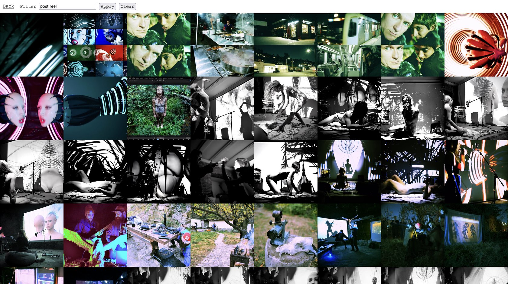

## Codercat Gallery

**Codercat Gallery** is a simple, minimalistic, and fast web gallery. It supports both locally stored media and media hosted on S3-compatible storage.



---

## Importing Instagram Data

To import Instagram data, run:

```bash
go run ./injest/main.go <insta_data_folder> <dst_dir>

# Example
go run ./injest/main.go ~/pr/instagram_data ./assets/media
```

> **Note:** The `<insta_data_folder>` should follow this directory structure:

```
instagram_data_archive/
└── <user>/
    └── content/
        ├── posts_1.json
        └── ...
    └── media/
        ├── reels/
        ├── posts/
        └── ...
```

---

## Development

For setting environmental variables make a file called `.env` with key value pairs. See `.env_local` as an example.

when run `export $(grep -v '^#' .env | xargs)` to set each variable in you active shell.

For easy build and auto realod functionallity use [go modd](https://github.com/cortesi/modd). The repo provide configuration for it. All you need to do to run the server is to call `modd`.

## Deployment

The gallery is built as a single self-contained binary, making deployment simple. I usually use the `scp` command in conjunction with `systemd` for persistence. (See the `deploy.sh` script.)

---

## Systemd Configuration

To run the gallery server as a persistent service, use the following `systemd` configuration:

```ini
[Unit]
Description=Codercat Gallery
After=network.target

[Service]
Environment=CCG_ASSETS_ROUTE=https://cdn.codercat.xyz/gallery
Environment=CCG_S3_ENDPOINT=nyc3.digitaloceanspaces.com
Environment=CCG_S3_REGION=nyc3
Environment=CCG_S3_BUCKET=cc-storage
Environment=CCG_S3_ROOT_DIR=gallery
Environment=CCG_S3_KEY=YOUR_S3_KEY
Environment=CCG_S3_SECRET=YOUR_S3_SECRET
WorkingDirectory=/home/kiko/gallery/
Type=simple
Restart=always
RestartSec=1
User=kiko
ExecStart=/home/kiko/gallery/gallery

[Install]
WantedBy=multi-user.target
```

> The environment variables above are configured for S3 media hosting.

For **local media hosting**, use variables specified in `.env_local`.
---

## Nginx Configuration

Using a reverse proxy like `nginx` is a good idea if you're running multiple applications on the same server. Add the following configuration to your Nginx site config (usually located in `/etc/nginx/sites-available/`):

```nginx
server {
    ...

    location /gallery/ {
        proxy_pass http://localhost:8080;
        proxy_http_version 1.1;
        proxy_set_header Upgrade $http_upgrade;
        proxy_set_header Connection 'upgrade';
        proxy_set_header Host $host;
        proxy_cache_bypass $http_upgrade;
    }

    # (Optional) For local asset hosting
    location /assets/ {
        root /home/kiko/gallery/;
    }
}
```